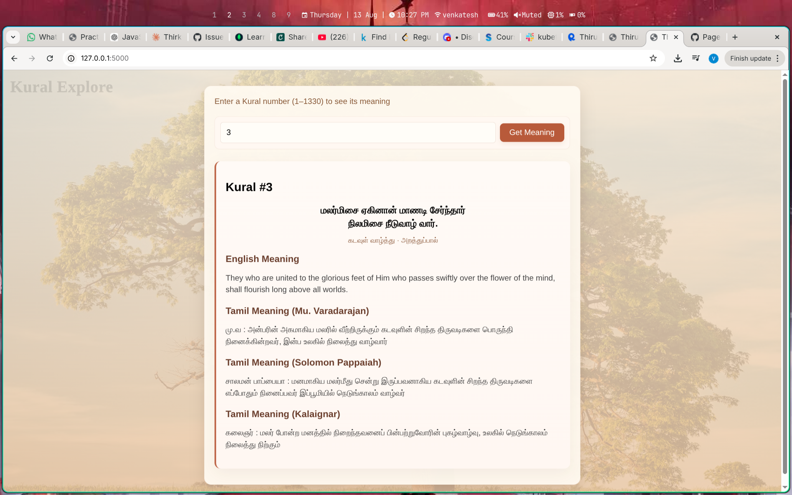

# Kural Exploror - Thirukkural Digital Explorer

A beautiful, mobile-first web application for exploring and understanding **Thirukkural**, one of the most important classical Tamil texts. Search through 1,330 ancient Tamil couplets and discover their meanings in English and multiple Tamil translations.

## 🌟 Features

- **Search Thirukkural entries** (1-1330) with instant results
- **Multiple translations** displayed for each kural:
  - English meaning
  - Tamil translation (Mu. Varadarajan)
  - Tamil translation (Solomon Pappaiah)
  - Tamil translation (Kalaignar)
- **Mobile-optimized design** – One-handed usable on smartphones with bottom-fixed input bar
 screens
- **Live API integration** – Fetches fresh data from the open-source Thirukkural API
 - **Screen-shot**

## 🖼️ Screenshot





## 🛠️ Tech Stack

| Layer | Technology |
|-------|------------|
| **Backend** | Python 3 + Flask |
| **Frontend** | HTML5, CSS3, Vanilla JavaScript |
| **Data Source** | [Thirukkural API](https://github.com/nramc/thirukkural-api) (Open Source) |


## 📁 Project Structure

```
Kural-Explore/
├── app.py                 # Flask application (main entry point)
├── README.md             # This file
│
├── static/               # Static assets
│   ├── style.css         # Warm theme stylesheet
│   └── script.js         # Scroll reveal animations
│
└── templates/            # HTML templates
    └── index.html        # Main application page
```


## 🌐 API Integration

The app uses the **open-source Thirukkural API**:
- **Endpoint**: `https://tamil-kural-api.vercel.app/api/kural/{number}`
- **No API key required**
- **Timeout**: 5 seconds per request
- **Error handling**: User-friendly messages for network failures

### Example API Response
```json
{
  "number": 1,
  "kural": ["அகர முதல எழுத்து", "ആകാരം മുതൽ എഴുത്ത്"],
  "chapter": "Aakam (Sacred)",
  "section": "Virtue",
  "meaning": {
    "en": "The syllable 'Ak' is the principal of all things...",
    "ta_mu_va": "அகரம் என்பது சகல விஷயங்களின் முதலாக...",
    "ta_salamon": "...",
    "ta_kalaignar": "..."
  }
}
```


